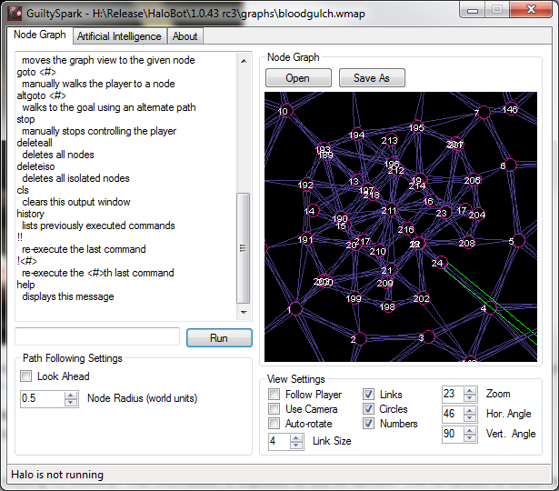
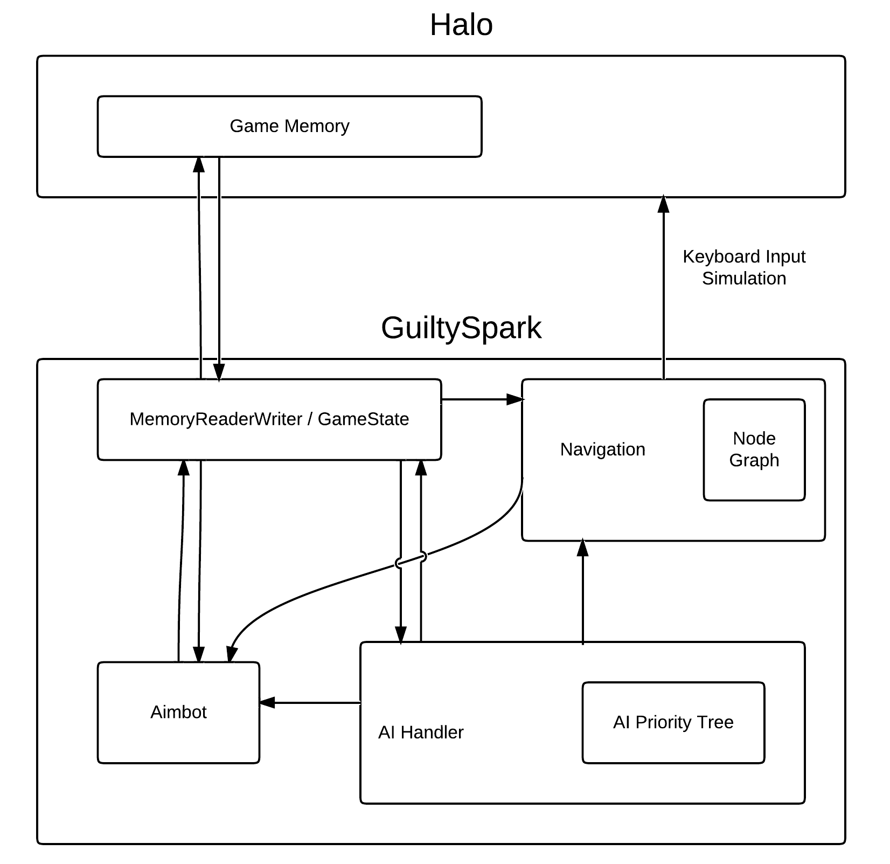

# GuiltySpark for Halo CE 1.08
Version: 1.0.43
Release: Dec 26th, 2011

GuiltySpark is a user-programmable automation engine for Halo CE. Users can create scripts that control the player's ingame reactions and behaviours. Scripts can range from simple key macros to bots that play the game without any user interaction. When activated, GuiltySpark controls the game for you by simulating mouse movement and keyboard input. Advanced scripts can take advantage of user-created pathfinding graphs.

The tool is implemented as a desktop GUI application which is used to build pathfinding data and run scripts. The application also calls windows APIs to simulate input, and read/write in Halo's memory space as it runs.

[Video of usage][6]

Some features of the tool include:

* Integrated aimbot
* Target visibility detection using map [BSP data][7]
* Pathfinding on user-created navigation graphs
* User-programmable scripting engine

## Development
This tool was developed over 2010-2011, partially as an 2nd year undergrad project. Development then halted after the 1.0.43 public release. More details can be found in the [development thread at modacity.net][3], [a development blog][5] set up for this project, any [my personal blog][4].

Warning: there be dragons in the codebase.

## Download
Release thread: [modacity.net][2]
Distributable download: [GuiltySpark-1.0.43.zip][1]

To get started, read [GuiltySpark.pdf](GuiltySpark.pdf).

[1]: http://con.modacity.net/halo/guiltyspark/GuiltySpark-1.0.43.zip
[2]: http://www.modacity.net/forums/showthread.php?24206-GuiltySpark-for-1.08-automate-your-player
[3]: http://www.modacity.net/forums/showthread.php?21417-WIP-GuiltySpark
[4]: https://t3hz0r.com/
[5]: https://csauve.wordpress.com/
[6]: https://www.youtube.com/watch?v=SpogBHQXg5k
[7]: https://en.wikipedia.org/wiki/Binary_space_partitioning
